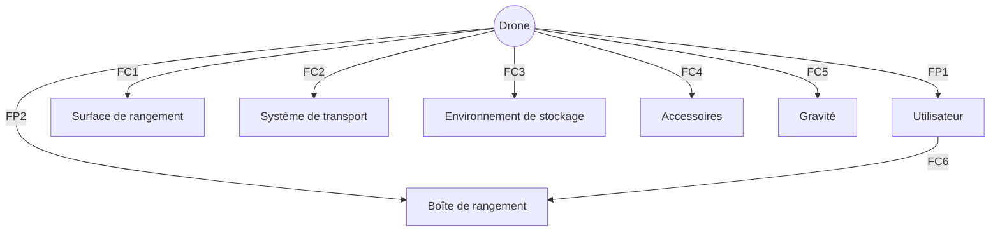
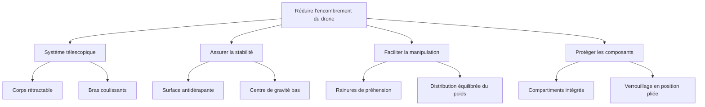

# Cahier des charges - Drone pliable

[La section Q2 reste inchangée]

## Q3 : Diagramme pieuvre du drone

## Q4 : Tableau d'analyse fonctionnelle du drone

| Fonction | Description | Critère | Niveau |
|----------|-------------|---------|--------|
| FP1 | Permettre à l'utilisateur de ranger facilement le drone | Temps de pliage | < 30 secondes |
| FP2 | S'adapter aux dimensions de la boîte de rangement | Dimensions pliées | ≤ 20 x 29 x 19 cm |
| FC1 | Être stable sur la surface de rangement | Stabilité | Ne bascule pas quand plié |
| FC2 | Résister aux contraintes de transport | Résistance aux chocs | Supporte chute de 1m |
| FC3 | S'adapter à l'environnement de stockage | Plage de température | -10°C à 50°C |
| FC4 | Permettre le rangement des accessoires | Espace pour accessoires | ≥ 200 cm³ |
| FC5 | Minimiser l'impact de la gravité lors du rangement | Masse | ≤ 1 kg |
| FC6 | Faciliter la manipulation par l'utilisateur | Prise en main | Poignée intégrée |

## Q5 : Matrice des solutions

| Fonction | Solution 1 | Solution 2 | Solution 3 |
|----------|------------|------------|------------|
| FP2 | Bras pliables | Hélices rétractables | Corps télescopique |
| FC1 | Base élargie en position pliée | Pieds rétractables | Surface antidérapante |
| FC6 | Poignée intégrée au corps | Sangle détachable | Rainures de préhension |

## Q6 : Préconcepts des solutions proposées

### Solution 1 : Bras pliables avec base élargie et poignée intégrée

Avantages :
- Réduction rapide et efficace de la taille
- Stabilité accrue en position pliée
- Facilité de transport grâce à la poignée

Inconvénients :
- Possible complexité du mécanisme de pliage
- Légère augmentation du poids global

### Solution 2 : Hélices rétractables avec pieds rétractables et sangle détachable

Avantages :
- Protection optimale des hélices pendant le transport
- Adaptabilité à différentes surfaces de rangement
- Polyvalence de la sangle pour le transport

Inconvénients :
- Mécanisme plus complexe et potentiellement fragile
- Risque de perte de la sangle détachable

### Solution 3 : Corps télescopique avec surface antidérapante et rainures de préhension

Avantages :
- Réduction maximale de l'encombrement
- Excellente stabilité sur diverses surfaces
- Prise en main naturelle sans ajout de poids

Inconvénients :
- Possible compromis sur la rigidité structurelle
- Complexité accrue de la fabrication

## Q7 : Évaluation des préconcepts

### Préconcept 1 : Bras pliables avec base élargie et poignée intégrée

| Fonction | Note (0-5) |
|----------|------------|
| FP1 | 4 |
| FP2 | 5 |
| FC1 | 4 |
| FC2 | 3 |
| FC3 | 4 |
| FC4 | 3 |
| FC5 | 4 |
| FC6 | 5 |
| Total | 32 |

### Préconcept 2 : Hélices rétractables avec pieds rétractables et sangle détachable

| Fonction | Note (0-5) |
|----------|------------|
| FP1 | 3 |
| FP2 | 5 |
| FC1 | 5 |
| FC2 | 4 |
| FC3 | 4 |
| FC4 | 3 |
| FC5 | 3 |
| FC6 | 4 |
| Total | 31 |

### Préconcept 3 : Corps télescopique avec surface antidérapante et rainures de préhension

| Fonction | Note (0-5) |
|----------|------------|
| FP1 | 3 |
| FP2 | 5 |
| FC1 | 5 |
| FC2 | 3 |
| FC3 | 4 |
| FC4 | 4 |
| FC5 | 5 |
| FC6 | 4 |
| Total | 33 |

## Q7 : Solution choisie

Après évaluation, la solution retenue est le Préconcept 3 : Corps télescopique avec surface antidérapante et rainures de préhension.

Description de la solution retenue :
Le drone sera conçu avec un corps central télescopique qui permet une réduction maximale de l'encombrement. Les bras supportant les moteurs et les hélices se rétracteront dans ce corps télescopique. La partie inférieure du drone sera équipée d'une surface antidérapante pour assurer la stabilité lors du rangement. Des rainures de préhension seront intégrées sur les côtés du corps pour faciliter la manipulation sans ajouter de poids supplémentaire. Cette solution offre le meilleur compromis entre la réduction de taille, la stabilité et la facilité de manipulation, tout en permettant un rangement optimal dans la boîte spécifiée.

## Q8 : Diagramme FAST

Ce diagramme FAST illustre les principales fonctions techniques nécessaires pour réduire l'encombrement du drone tout en assurant sa stabilité, sa facilité de manipulation et la protection de ses composants lors du rangement dans la boîte spécifiée.
